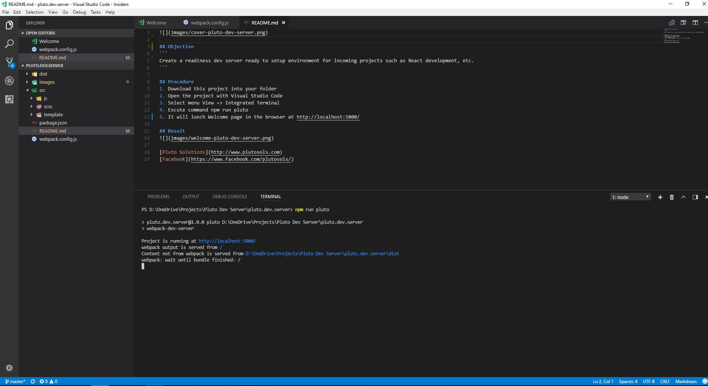

[Pluto Solutions](http://www.plutosols.com)
[Facebook](https://www.facebook.com/plutosols/)

## Objective
```
Create a readiness dev server ready to setup environment for incoming projects such as React development, etc.
```

# Pre-requirements
You need to install [node.js](https://nodejs.org/en/) and [npm](https://www.npmjs.com/) before starting procedure.

## Procedure
1. Download this project into your folder
2. Open the project with Visual Studio Code
3. Select menu View => Integrated Terminal
4. Execute command => npm run pluto
5. It will lunch Welcome page in the browser at http://localhost:5000/

## Running in Visual Studio Code


## Result
